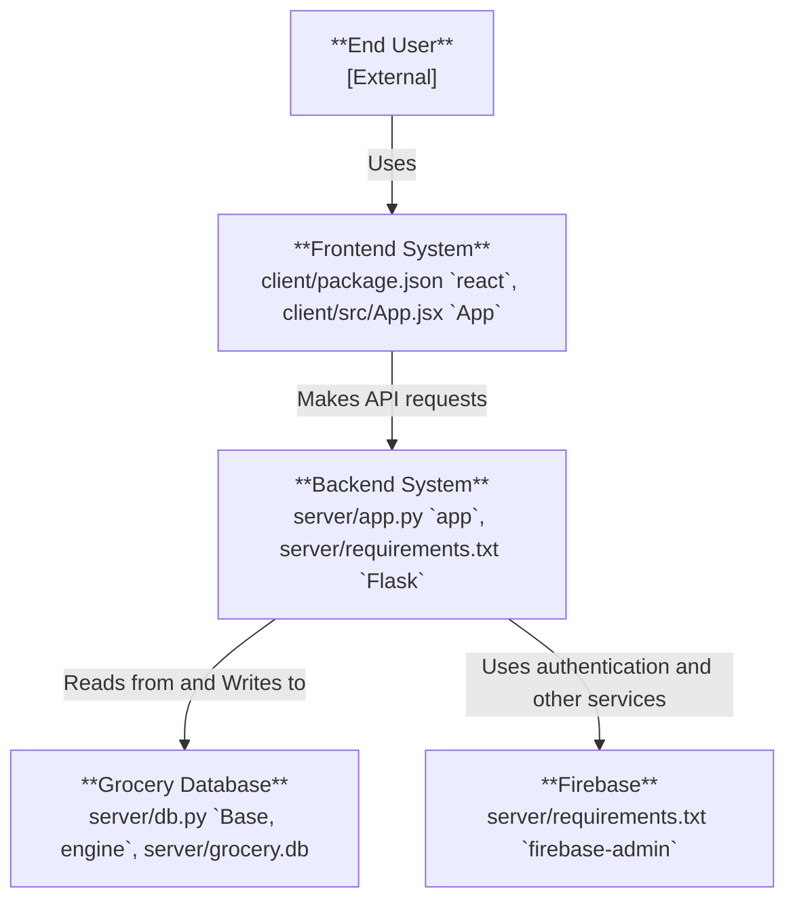

# Unnamed CodeViz Diagram

```mermaid
graph TD

    base.cv::frontend["**Frontend System**<br>client/package.json `react`, client/src/App.jsx `App`"]
    base.cv::backend["**Backend System**<br>server/app.py `app`, server/requirements.txt `Flask`"]
    base.cv::grocery_db["**Grocery Database**<br>server/db.py `Base, engine`, server/grocery.db"]
    base.cv::end_user["**End User**<br>[External]"]
    base.cv::firebase["**Firebase**<br>server/requirements.txt `firebase-admin`"]
    %% Edges at this level (grouped by source)
    base.cv::end_user["**End User**<br>[External]"] -->|"Uses"| base.cv::frontend["**Frontend System**<br>client/package.json `react`, client/src/App.jsx `App`"]
    base.cv::frontend["**Frontend System**<br>client/package.json `react`, client/src/App.jsx `App`"] -->|"Makes API requests"| base.cv::backend["**Backend System**<br>server/app.py `app`, server/requirements.txt `Flask`"]
    base.cv::backend["**Backend System**<br>server/app.py `app`, server/requirements.txt `Flask`"] -->|"Reads from and Writes to"| base.cv::grocery_db["**Grocery Database**<br>server/db.py `Base, engine`, server/grocery.db"]
    base.cv::backend["**Backend System**<br>server/app.py `app`, server/requirements.txt `Flask`"] -->|"Uses authentication and other services"| base.cv::firebase["**Firebase**<br>server/requirements.txt `firebase-admin`"]

```
---
*Generated by [CodeViz.ai](https://codeviz.ai) on 1/26/2026, 2:22:50 PM*
