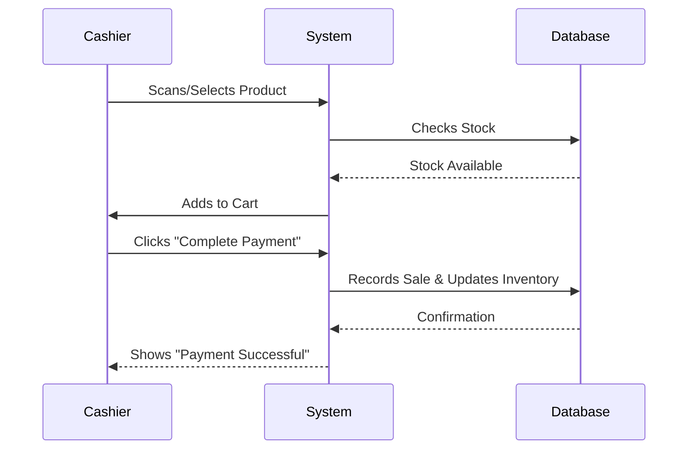

# GrocerySync: Project Documentation

## 1. Project Overview

### What is GrocerySync?
GrocerySync is a smart, easy-to-use software made for running small grocery stores. It helps store owners manage their items (inventory), sell to customers (billing), and see how their business is doing (reports)—all in one place.

### Why does it exist?
Small stores often struggle with paper records or systems that are too expensive or hard to use. GrocerySync solves this by offering a *free*, powerful tool that brings modern technology (like AI) to small businesses.

### Target Audience
*   **Store Owners**: To track sales and profits.
*   **Managers**: To handle stock reordering and staff.
*   **Staff (Cashiers)**: To quickly scan and sell items to customers.

### Key Features and Capabilities
*   **Real-time Inventory**: Know exactly what you have in stock at any moment.
*   **Quick Billing**: Fast checkout process to keep lines moving.
*   **Smart Reports**: Visual charts showing sales, top items, and revenue.
*   **Loyalty Program**: Reward regular customers with points to keep them coming back.
*   **Customer Support Chatbot (Planned)**: AI helper for questions.

---

## 2. Project Timeline
Based on our development roadmap outlined in the proposal:

*   **Sprint 1 (August 2025):**
    *   ✅ **Inventory Module**: Adding, editing, and tracking products.
    *   ✅ **Billing Module**: Cart management and checkout processing.
*   **Sprint 2 (September 2025):**
    *   ✅ **Purchasing Automation**: Tools to help restock items.
    *   ✅ **MIS Reports**: Dashboards for business analytics.
*   **Sprint 3 (October 2025):**
    *   🚧 **Chatbot Assistant**: AI support for staff/customers.
    *   ✅ **Loyalty Program**: Points and rewards system.

---

## 3. Getting Started

### Prerequisites
Before you begin, make sure you have these installed on your computer:
1.  **Node.js**: Required for the website part. [Download Here](https://nodejs.org/)
2.  **Python (version 3.8 or higher)**: Required for the server part. [Download Here](https://www.python.org/)

### Installation Guide

**Step 1: Get the Code**
Download or clone this project folder to your computer.

**Step 2: Set up the Website (Frontend)**
Open your terminal (command prompt), go to the project folder, and run:
```bash
npm install
```
*This downloads all the tools needed for the look and feel of the app.*

**Step 3: Set up the Server (Backend)**
In your terminal, go to the `server` folder and run:
```bash
cd server
python3 -m venv venv
# On Windows, use: venv\Scripts\activate
# On Mac/Linux, use:
source venv/bin/activate

pip install -r requirements.txt
```
*This sets up the brain of the application and keeps its tools separate from your other files.*

### Quick Start / Basic Usage
To run everything at once, we have a handy script.
1. Make sure you are in the main project folder.
2. Run:
   ```bash
   ./run-dev.sh
   ```
3. Open your browser and go to `http://localhost:5173`.
4. **Log in**: Use your credentials (or ask the admin for a login).
5. **Start Selling**: Go to the "POS" or "Cart" page to start adding items for a customer.

---

## 4. Visual Guides & Architecture

### System Architecture
This diagram shows how the different parts of GrocerySync talk to each other.

```mermaid
graph TD
    Client[Client (React App)]
    Server[Server (Flask API)]
    DB[(Database SQLite)]
    AI[AI Services]

    Client -- "Sends Requests (e.g., Log in)" --> Server
    Server -- "Reads/Writes Data" --> DB
    Server -- "Asks for Analysis" --> AI
    Server -- "Sends Data Back" --> Client
```

### Billing Process Flow
How a sale happens in the system:



---

## 5. Technical Details

### Architecture Overview
*   **Frontend (The Face):** Built with **React**. It's what you see and click on. It uses **Tailwind CSS** to look modern and clean.
*   **Backend (The Brain):** Built with **Python Flask**. It receives your clicks, does the math, and talks to the database.
*   **Database (The Memory):** **SQLite**. A secure file that stores all your products, sales, and user details.

### Key Data Structures (Models)
*   **User**: Stores username, password (encrypted), and "Loyalty Points".
*   **Product**: Contains Name, Price, Image, and Category.
*   **Order**: A record of who bought what, when, and the total cost.

### API Reference (Function Documentation)
*   **`GET /api/products`**: Fetches a list of all items in the store.
*   **`POST /api/orders`**: Saves a new sale to the database.
*   **`GET /api/analytics`**: Calculates totals for the dashboard graphs.
*   **`POST /api/auth/login`**: Checks username/password and logs you in.

### Configuration
*   **Environment Variables**: Stored in a `.env` file (like API keys or secret passwords).
*   **Database Config**: Settings for where the SQLite file is saved.

---

## 6. Troubleshooting

### Common Issues

**1. "The website won't load in the browser."**
*   *Cause:* The frontend server might not be running.
*   *Fix:* Check your terminal. Make sure you ran `npm run dev:client` and it says "Local: http://localhost:5173".

**2. "I see a 'Network Error' when logging in."**
*   *Cause:* The backend (Python) server is off.
*   *Fix:* Open a new terminal tab, go to `server`, and run `python -m server.app` (or use the start script).

**3. "I can't see the new products I added."**
*   *Cause:* The list might not have refreshed.
*   *Fix:* Refresh your browser page. If that fails, check if the database file is locked or open in another program.

**4. "Installation failed on 'pip install'."**
*   *Cause:* You might be using an old version of Python or missing permissions.
*   *Fix:* Ensure you have Python 3.8+. On Linux/Mac, you might need to use `pip3`.
